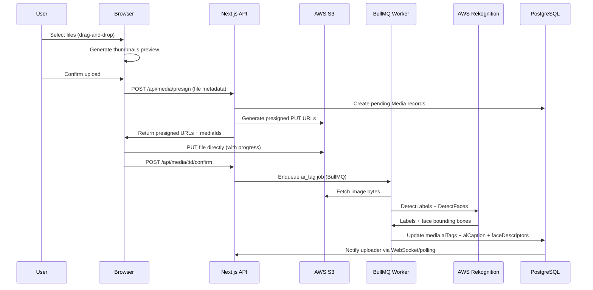
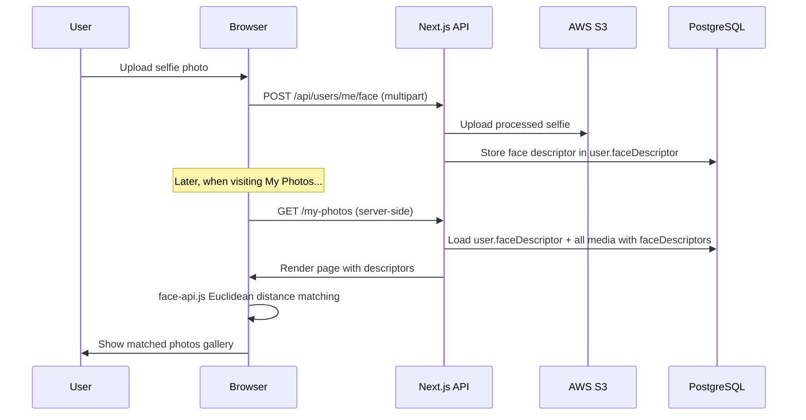

# PixVault — Architecture Overview

## System Architecture Diagram

```mermaid
graph TB
    subgraph Client["Client Layer (Browser / PWA)"]
        UI["Next.js 14 App Router\nReact Server Components + Client Components"]
        Store["Zustand State\n(auth · upload · notifications · ui)"]
        Query["TanStack Query\n(server cache + infinite scroll)"]
    end

    subgraph Auth["Auth Layer"]
        NextAuth["NextAuth.js\nJWT sessions"]
        Providers["Credentials · Google · GitHub OAuth"]
    end

    subgraph API["API Layer (Next.js Route Handlers)"]
        EventsAPI["/api/events\nCRUD + publish/archive"]
        MediaAPI["/api/media\nUpload · Like · Comment · Share · Download"]
        UsersAPI["/api/users\nProfile · Face selfie"]
        NotifAPI["/api/notifications\nReal-time feed"]
        AdminAPI["/api/admin\nUsers · Clubs · Ban"]
        AIAPI["/api/ai/tag\nAI tagging trigger"]
    end

    subgraph Storage["Storage Layer"]
        S3["AWS S3\nOriginals · Thumbnails · Avatars"]
        CF["CloudFront CDN\nEdge-cached delivery"]
        Sharp["Sharp\nWebP · Thumbnails · BlurHash · Watermark"]
    end

    subgraph AI["AI / ML Layer"]
        Rekognition["AWS Rekognition\nLabel detection · Face detection"]
        FaceAPI["face-api.js\nClient-side face descriptor matching"]
        Caption["BLIP Caption Model\nSalesforce/blip-image-captioning-base"]
    end

    subgraph Data["Data Layer"]
        Postgres["PostgreSQL 16\nvia Prisma ORM"]
        Redis["Redis\nQueue · Rate limiting · Cache"]
        BullMQ["BullMQ Workers\nAI tagging · Thumbnail generation"]
    end

    subgraph Infra["Infrastructure"]
        GH["GitHub Actions\nCI: lint → test → build → deploy"]
        Vercel["Vercel / Railway\nServerless deployment"]
    end

    UI --> NextAuth
    UI --> EventsAPI & MediaAPI & UsersAPI & NotifAPI & AdminAPI
    MediaAPI --> Cloudinary
    MediaAPI --> Sharp
    Cloudinary --> UI
    AIAPI --> HuggingFace["Hugging Face API"]
    Rekognition --> Caption
    FaceAPI --> UI
    EventsAPI & MediaAPI & UsersAPI & NotifAPI & AdminAPI --> Postgres
    BullMQ --> Redis
    BullMQ --> AIAPI
    GH --> Vercel
```



## Data Flow — Media Upload



## Data Flow — Face Recognition (My Photos)



## Database Schema (Key Relations)

```mermaid
erDiagram
    User {
        string id PK
        string email UK
        string username UK
        string role
        float[] faceDescriptor
    }
    Club {
        string id PK
        string name UK
        string slug UK
    }
    Event {
        string id PK
        string slug UK
        string status
        string accessLevel
        string ownerId FK
        string clubId FK
    }
    Album {
        string id PK
        string eventId FK
    }
    Media {
        string id PK
        string type
        string s3Key UK
        string[] aiTags
        json faceDescriptors
        string uploaderId FK
        string eventId FK
        string albumId FK
    }
    Like { string userId FK; string mediaId FK }
    Comment { string userId FK; string mediaId FK; string parentId FK }
    MediaTag { string mediaId FK; string taggedUserId FK }
    Notification { string recipientId FK; string senderId FK }
    AuditLog { string userId FK; string action }

    User ||--o{ Event : owns
    User ||--o{ Media : uploads
    Club ||--o{ Event : hosts
    Event ||--o{ Album : contains
    Event ||--o{ Media : contains
    Album ||--o{ Media : groups
    User ||--o{ Like : gives
    Media ||--o{ Like : receives
    Media ||--o{ Comment : has
    Media ||--o{ MediaTag : has
    User ||--o{ Notification : receives
```

## Access Control Matrix

| Role | Public Media | Members-Only | Private | Upload | Create Event | Admin Panel |
|---|---|---|---|---|---|---|
| Viewer | ✅ | ❌ | ❌ | ❌ | ❌ | ❌ |
| Club Member | ✅ | ✅ | ❌ | ❌ | ✅ | ❌ |
| Photographer | ✅ | ✅ | ❌ | ✅ | ✅ | ❌ |
| Admin | ✅ | ✅ | ✅ | ✅ | ✅ | ✅ |
| Super Admin | ✅ | ✅ | ✅ | ✅ | ✅ | ✅ |

## Tech Stack Summary

| Layer | Technology |
|---|---|
| Framework | Next.js 14 (App Router, RSC) |
| Language | TypeScript (strict) |
| Styling | Tailwind CSS + custom design tokens |
| Database | PostgreSQL 16 + Prisma ORM |
| Auth | NextAuth.js (JWT + OAuth) |
| Storage | AWS S3 + CloudFront CDN |
| AI Tagging | AWS Rekognition |
| Face Match | face-api.js (client-side Euclidean) |
| Image Processing | Sharp (WebP, thumbnails, watermark, BlurHash) |
| State | Zustand + TanStack Query v5 |
| Queue | BullMQ + Redis |
| Forms | React Hook Form + Zod |
| Testing | Jest + Playwright |
| CI/CD | GitHub Actions |
| Deployment | Vercel / Railway |
